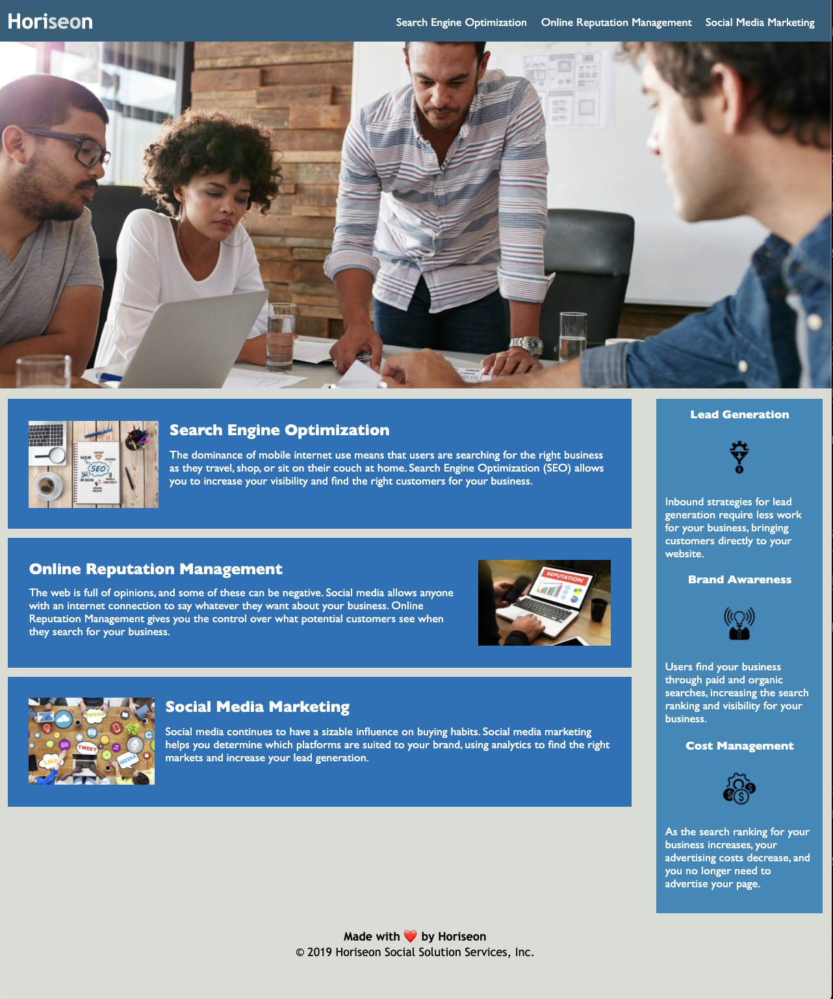

# Code Refactor

## Description:

The aim for this project is to refactor/improve a website's codebase (both the HTML and CSS files) for Horiseon, a hypothetical marketing agency. The client's user story is that the agency wants a codebase that follows accessibility standards to optimize it for search engines.
## Installation:

1. Clone or donwload repository
2. Open file "index.html" in web-browser in order to view the webpage


## User Story

```
AS A marketing agency
I WANT a codebase that follows accessibility standards
SO THAT our own site is optimized for search engines
```

## Acceptance Criteria

```
GIVEN a webpage meets accessibility standards
WHEN I view the source code
THEN I find semantic HTML elements
WHEN I view the structure of the HTML elements
THEN I find that the elements follow a logical structure independent of styling and positioning
WHEN I view the image elements
THEN I find accessible alt attributes
WHEN I view the heading attributes
THEN they fall in sequential order
WHEN I view the title element
THEN I find a concise, descriptive title
```
## Links:

[Deployed Link](https://mus-ali1.github.io/refactor-code/)

[Git Hub Repo](https://github.com/mus-ali1/refactor-code)


